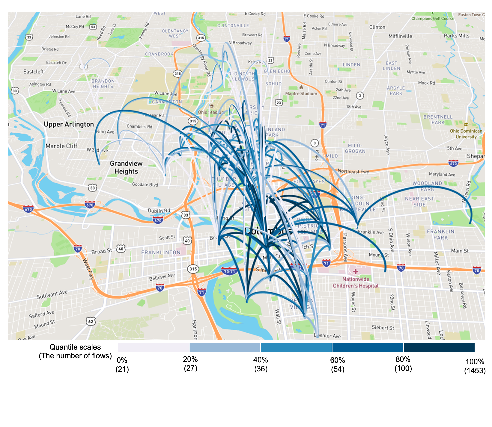
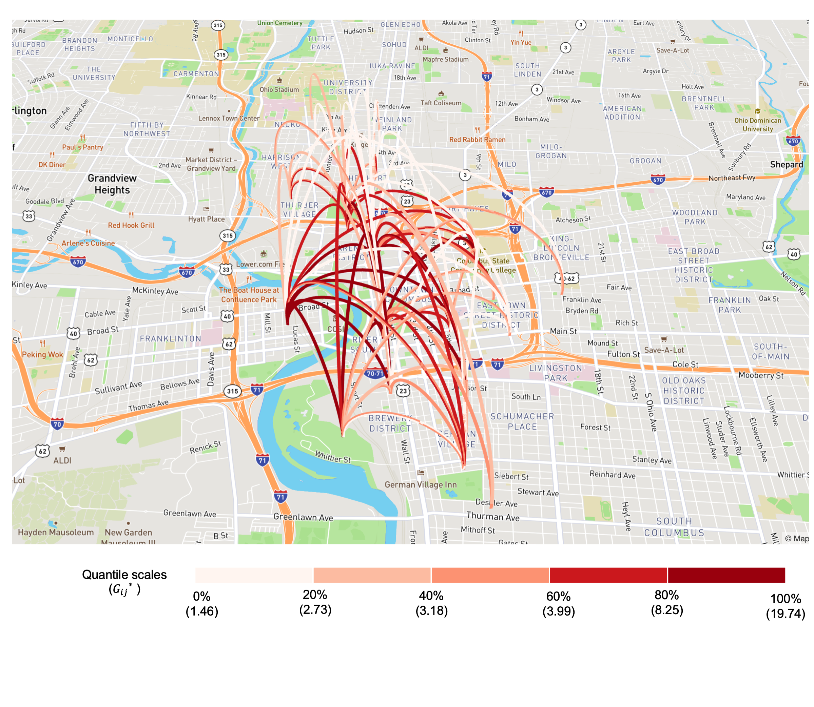

# spnaf R package
# Unraveling Hotspots: 
# An Exploratory Spatial Data Analysis of Columbus Bike Sharing Flow


```{r setup, include=FALSE}
knitr::opts_chunk$set(echo = TRUE)
library(dplyr)
library(spnaf)
library(sf)
library(mapdeck)
library(RColorBrewer)
```


## Data Processing

At first, we need to load the libraries {dplyr},{spnaf},{sf},{mapdeck}, and {RColorBrewer}

```{r load the libraries need}
library(dplyr)
library(spnaf)
library(sf)
library(mapdeck)
```


We read the CoGo (a bike-sharing program) trip data for the year 2019, which is aggregated by Census Block Groups (CBGs).


```{r load data}
cogo_2019<-read.csv("Data/cogodata_2019.csv")
cogo_volume<-cogo_2019%>% group_by(From_ID,To_ID)%>%summarise(f_n=sum(count))
names(cogo_volume)<-c("oid", "did","n")
cogo_volume$oid <- as.character(cogo_volume$oid)
cogo_volume$did <- as.character(cogo_volume$did)
```


We import a shapefile containing the boundaries of Ohio's CBGs and filter to only retain the CBGs involved in the bike-sharing trips.


```{r import shapefile}
shape <-st_read('Data/Franklin_BG_1.shp')
shape <- shape %>% filter(id %in% cogo_volume$oid | id %in% cogo_volume$did)
```


## Calculation of the Gij\* values 


We calculate Gij\* using the 'Gij.polygon' function. And we select 0.05 of the p-value as a significance level.


```{r Gij calculation}
result <- Gij.polygon(df = cogo_volume ,shape = shape , queen = TRUE, snap = 1, method = 't')
result<-as.data.frame(result[[2]])
cogo_pval<-subset(result, result$pval<0.05)
head(cogo_pval)
```


## Visualization


We now create interactive visualizations of the results using the {mapdeck} package. Remember to replace `pk.abc` with your own mapbox token to make sure the interactive map works.


```{r set up the personal token}
key<-'pk.abc' ## put your own token here
set_token(key)
```


We open the file including geometry information of each CBG.


```{r open the geometry file}
id_geometry<-read.csv("Data/id_geometry_f.csv")
```


We first visualize the total flows(\>20) on the interactive map. We merge the previously created 'cogo_volume' dataset with the 'id_geometry' dataset by 'oid' and 'id', and then again by 'did' and 'id. This process links trip volume data with corresponding geometric information.


```{r data processing}
total_geo<-merge(cogo_volume,id_geometry,by.x="oid",by="id")
total_geo<-merge(total_geo,id_geometry,by.x="did",by="id")
```


We then filter out rows where 'oid' is equal to 'did' to remove trips that start and end in the same place.


```{r filter the data.frame}
total_geo<-subset(total_geo,total_geo$oid!=total_geo$did)
total_map<-as.data.frame(cbind(total_geo$x.x,total_geo$y.x,total_geo$x.y,total_geo$y.y,total_geo$n))
```


We rename the data.frame columns to denote the start and end coordinates of each trip.


```{r rename the data.frame}
names(total_map)<-c("start_lon", "start_lat","end_lon", "end_lat","n")
```


We generate an 'id' column to assign unique identifiers to each row and a 'stroke' column to determine the width of the lines to be drawn on the map.


```{r generate columns}
total_map$id<-seq_len(nrow(total_map))
total_map$stroke <- round((percent_rank(total_map$n)*5),digits = 3)
```

We filter the data to only include trips that have a total volume of more than 20.

```{r subset the data.frame}
total_map<-subset(total_map,total_map$n>20)
```


We use the quintiles to categorize the trip volumes.Thus, we first define the range for the 'n'(trip volume) variable. Then we create the break points for the quintile scales of the 'n'. After these processes, we create 'n_cat' variable to cut 'n' into quintiles


```{r cut into quintiles}
n_range <- range(total_map$n)
break_points <- quantile(total_map$n, probs = seq(0, 1, 0.2), na.rm = TRUE)
total_map$n_cat <- cut(total_map$n, breaks = break_points, labels = FALSE, include.lowest = TRUE)
```


And we assign the colors to each quintile category using the color palette.


```{r assing colors}
color_func <- colorRampPalette(c("#C6DBEF", "#9ECAE1", "#4292C6","#2171B5", "#084594"))
palette <- color_func(5)
total_map$n_color <- palette[as.integer(total_map$n_cat)]
```


We create an interactive map with arcs representing the bike trips.The color of each arc are determined by the number of trips (volume).


```{r visualization:total volumes,eval=FALSE}
mapdeck(token = key, style = mapdeck_style("streets"), pitch = 45) %>%
  add_arc(
    data = total_map,
    layer_id = "arcs",
    origin = c("start_lon", "start_lat"),
    destination = c("end_lon", "end_lat"),
    stroke_from = "n_color",
    stroke_to = "n_color",
    stroke_from_opacity = 0.6,
    stroke_to_opacity = 0.6,
    stroke_width = "stroke",
    auto_highlight = TRUE
  )
```




Next, we visualize flow hot-spots with a p-value of 0.05. Follow similar steps as in the total flow visualization, but this time merging 'cogo_pval' with 'id_geometry'.


```{r data processing for flow hot-spots}
gij_geo<-merge(cogo_pval,id_geometry,by.x="oid",by="id")
gij_geo<-merge(gij_geo,id_geometry,by.x="did",by="id")
gij_map<-as.data.frame(cbind(gij_geo$x.x,gij_geo$y.x,gij_geo$x.y,gij_geo$y.y,gij_geo$Gij,gij_geo$pval))
names(gij_map)<-c("start_lon", "start_lat","end_lon", "end_lat","Gij","pval")
gij_map$id<-seq_len(nrow(gij_map))
gij_map$stroke <- round((percent_rank(gij_map$Gij)*5),digits = 3)
```


In this case, we use the quintiles for categorize Gij\* values. First we define the range for the 'Gij' variable(Gij\*).


```{r cut the Gij valables into quintiles}
n_range <- range(gij_map$Gij)
break_points <- quantile(gij_map$Gij, probs = seq(0, 1, 0.2), na.rm = TRUE)
gij_map$n_cat <- cut(gij_map$Gij, breaks = break_points, labels = FALSE, include.lowest = TRUE)
```


We define color palette for the hot-spots. We use the red colors to visualize the hot-spots. We assign the red colors to the quintile scales of the Gij\* values.


```{r assing red colors to the Gij quintiles}
color_func <- colorRampPalette(c("#FFF5F0", "#FCBBA1", "#FC9272", "#CB181D", "#99000D")) 
palette <- color_func(5) 
gij_map$n_color <- palette[as.integer(gij_map$n_cat)]
gij_map$n_color <- palette[as.integer(gij_map$n_cat)]
```


Finally, we create an interactive map with arcs representing the Gij\* vlaues of bike sharing hot-spots.The color of each arc are determined by the Gij\* values.


```{r visulazation:flow hot-spots,eval=FALSE}
mapdeck(token = key, style = mapdeck_style("streets"), pitch = 45) %>%
  add_arc(
    data = gij_map,
    layer_id = "arcs",
    origin = c("start_lon", "start_lat"),
    destination = c("end_lon", "end_lat"),
    stroke_from = "n_color",
    stroke_to = "n_color",
    stroke_from_opacity = 0.6,
    stroke_to_opacity = 0.6,
    stroke_width = gij_map$Gij* 3, # assuming 'n' also determines width of arcs
    auto_highlight = TRUE
  )
```



